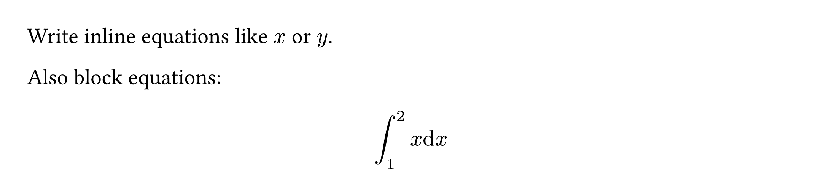

# [MiTeX](https://github.com/OrangeX4/typst-mitex)

**LaTeX support for Typst, powered by wasm.**

MiTeX processes LaTeX strings through a parser to generate an abstract syntax tree (AST), which is then transformed into Typst strings and rendered.

MiTeX is not only very **COMPACT** but also **FAST**! MiTeX has a size of just over one hundred kilobytes, and its rendering speed is nearly indistinguishable from native equations.

Thanks to [@Myriad-Dreamin](https://github.com/Myriad-Dreamin), he completed the most complex development work: developing the parser for generating AST.

## Currently Implemented Features

- [x] LaTeX equations support
- [x] Coloring commands (`\color{red}`, `\textcolor{red}`)
- [x] Support for various environments, such as aligned, matrix, cases


## Features to be Implemented

- [ ] User-defined commands (specification), such as `\newcommand{\mysym}{\alpha}`
- [ ] Text mode support, enabling the writing of LaTeX titles, paragraphs, and figures directly in Typst!


## Examples

```typst
#import "lib.typ": *
// #import "@preview/mitex:0.1.0": *

#assert.eq(mitex-convert("\alpha x"), "alpha  x ")

Write inline equations like #mi("x") or #mi[y].

Also block equations:

#mitex(`
  \int_1^2 x \mathrm{d} x
`)
```




## Differences from other solutions

MiTeX has different objectives compared to pandoc and texmath:

- MiTeX focuses on rendering LaTeX content correctly within Typst, leveraging the powerful programming capabilities of wasm and typst to achieve results that are essentially consistent with LaTeX display.
- Pandoc and texmath aim to be general-purpose converters and generate strings that are more human-readable.

For example, MiTeX transforms \frac{1}{2}_3 into frac(1, 2)_3, while pandoc/texmath converts it into 1 / 2_3. The latter's display is not entirely correct, whereas the former ensures consistency in display.

Another example is that MiTeX transforms (\frac{1}{2}) into \(frac(1, 2)\) instead of (frac(1, 2)), avoiding the use of automatic Left/Right to achieve consistency with LaTeX rendering.

**Certainly, the greatest advantage is that you can directly write LaTeX content in Typst without the need for manual conversion!**